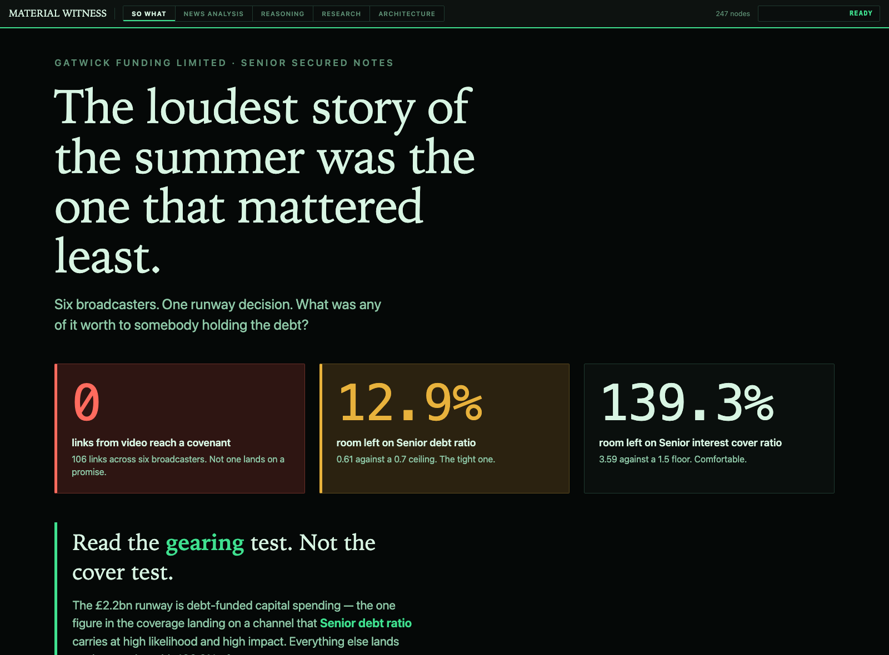
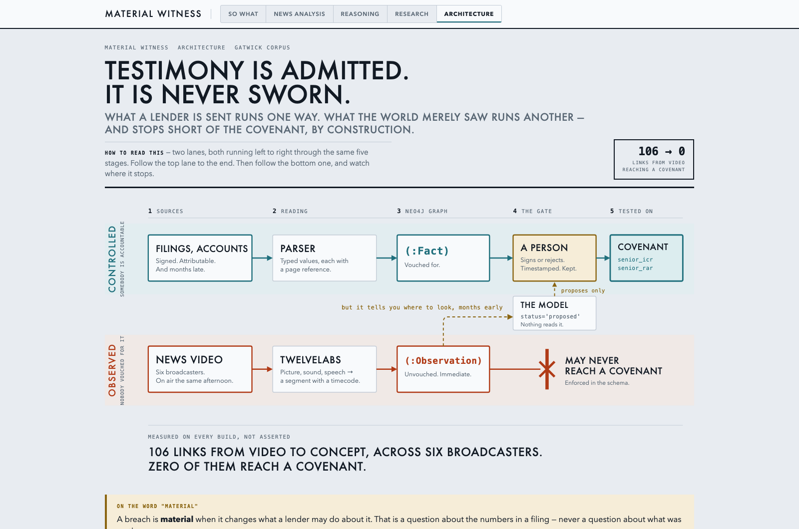
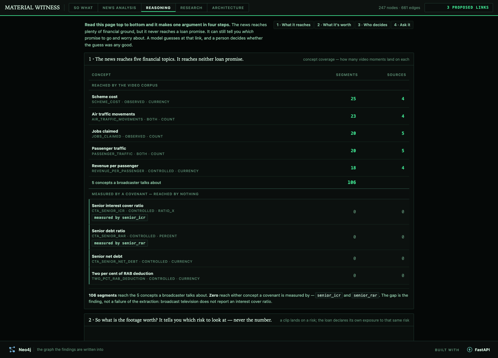
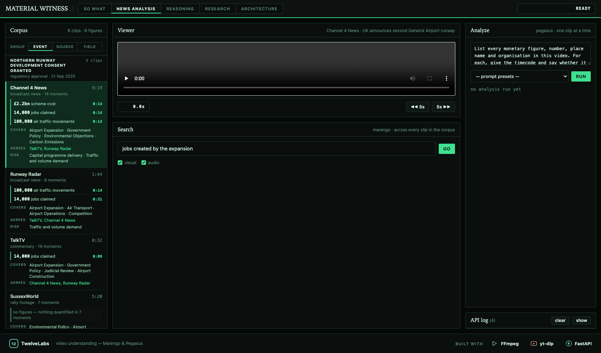

# Material Witness

### Testimony is admitted. It is never sworn.

**Live → [hack-video-v6kg.onrender.com](https://hack-video-v6kg.onrender.com)** · Built for
*Hack the Video Agent Context Graph*, 30 July 2026, AWS Builder Loft, San Francisco.

---

Credit systems run on a **controlled document supply chain**: things a lender is *sent*, by
somebody who is accountable if they are wrong. Filings, audited accounts, compliance
certificates. **News footage is none of that.** Nobody sent it, nobody is on the hook for it,
and it was not produced for the lender. A system that quietly treats a broadcast like a filing
is lying about where its numbers came from.

So this indexes nine broadcasters covering Gatwick with **TwelveLabs**, turns
their timecoded segments into typed claims and canonical entities with **GPT-5.6**, and writes
the lot into a **Neo4j** graph whose schema *encodes* that argument rather than decorating it.

The rule that schema enforces is one line long. A `Source` is either **`controlled`** or
**`observed`**, and an observed source produces only an `Observation`: **it may never produce a
`Fact`, and it may never supply a covenant number.** Which turns the question from an opinion
into a count:

| Counted on every build | |
|:--|--:|
| Links from video to concept | **106** |
| Broadcasters carrying them | **6** |
| **Of those links reaching either covenant** | **0** |

That zero is not a gap in the corpus. **News does not carry covenant data**, and a graph that
declines to bridge that gap is the product.

---



## The bridge — where video earns its place

A negative finding on its own dead-ends. The useful half is this shape:

```
   Observation ──SUGGESTS_RISK──▶   Risk   ◀──EXPOSED_TO──  Covenant ──▶ Threshold
    (observed)                     (sink)                       ▲
                                                         Fact ──┘   (controlled only)
```

A `Risk` is a **channel of exposure** — capital programme delivery, traffic and volume demand,
regulated revenue reset. It carries no value, no unit, no direction and no threshold. **Both
arrows point into it**, so getting from a clip to a covenant means traversing `EXPOSED_TO`
*backwards* — which is visible in the query text, on screen, in front of the person being asked
to believe it.

Safety by type, not by policy. The next engineer breaks policies. They cannot break types — and
the provenance rule is a query anyone can run, not a promise anyone has to take:

```cypher
// integrity check — must return zero rows
MATCH (f:Fact)-[:FROM]->(s:Source {provenance_class:'observed'}) RETURN f;
```



> ### Video can move where a credit analyst looks. It can never move what they read.

---

## So what: the one thing the footage was actually worth

Three figures are spoken on air across the corpus. Here is where each of them lands.

| Said on air | Channel of exposure | The promise that carries it |
|:--|:--|:--|
| **£2.2bn** scheme cost — Channel 4 News, 14.4s | Capital programme delivery | **Senior RAR** — carried `high` / `high` |
| **100,000** movements — Channel 4 News, Runway Radar | Traffic and volume demand | Senior ICR — `medium` / `high` |
| **14,000** jobs — three broadcasters | *lands on nothing* | — |

And the two promises are not equally tight:

| Covenant | Trigger Event | Event of Default | **31 March 2018** | Headroom to trigger |
|:--|:--|:--|--:|--:|
| Senior ICR | min **1.50×** | 1.10× | 3.59× | **139%** |
| **Senior RAR** | max **0.70** | 0.85 | 0.61 | **12.9%** |

Both ratios come from Gatwick Airport Limited's **own audited accounts**, cited on the node,
never from footage. Both thresholds come from the **Common Terms Agreement dated 15 February
2011**. The two tiers do different things: a Trigger Event locks up distributions, an Event of
Default risks acceleration.

**The 0.61 is the 31 March 2018 vintage** — the most recent filing loaded, and it is labelled
as such everywhere it is quoted. It is not a current ratio and must never be read as one.

Put the two tables together and the finding falls out. The £2.2bn is debt-funded capital
spending, and it is the **only** figure in the corpus landing on a channel that the *tight*
covenant carries at `high` / `high`. **So the footage says: go and read the gearing test, not
the cover test** — months before the filing that settles it exists.

The footage supplied no ratio and moved no number. It could not have. It told a reader *which
of two tests to go and open*, early. **That gap is the whole product.**

## The counter-example — what admissible evidence looks like

A negative is only worth anything if the same graph can be shown reaching a covenant when the
evidence is admissible. The So what page carries that too, read live: the same two covenants,
tested twice a year, entirely from Gatwick's own compliance certificates.

| Tested | Senior ICR · trigger 1.50, default 1.10 | Senior RAR · trigger 0.70, default 0.85 | |
|:--|--:|--:|:--|
| **31 March 2019** | **2.93** | **0.59** | **clear — and this is the drone year** |
| 31 December 2020 | (1.29) | 0.94 | both through Event of Default |
| **31 December 2021** | **(1.49)** | **0.81** | ICR through Default; RAR through Trigger only |

The drone shut Britain's second airport and led every bulletin on earth, and the financial
year containing it tested clear on both — *"all financial covenants have been tested and
complied with as at 31 March 2019"*. **The word "drone" appears zero times in that 103-page
report.** Two years later, a pandemic nobody filmed at Gatwick put interest cover at −1.49,
and two officers signed a certificate saying a Default had occurred and was continuing. It was
waived: the **Amendment and Waiver Agreement dated 8 September 2021**, and before it the **22
September 2020 Amendments**.

Loud is not material, and material is not loud. The system reads the video and honestly
reports zero; it reads the certificate and carries it all the way to the threshold. **It is
not incapable — it is discriminating**, and that is the difference the counter-example exists
to prove. Working and sources: [`docs/07-the-counter-example.md`](docs/07-the-counter-example.md).

---

And the discipline is the other half of it. The water outage led every bulletin and was worth
nothing. A model said otherwise. A person overruled it.

---



## A model may only ever propose

Every model-written edge is `status='proposed'` and **inert**: no computation reads it until a
human signs. A rejection is **kept**, never deleted.

On 29 July the model proposed that an eleven-hour water outage could hit the interest cover
ratio. It could not — no flight was cancelled, the airport never closed, water was back across
the campus inside eleven hours. A terminal-services failure, not an air-operations one. So:

```
Airport water supply failure ──MAY_AFFECT──▶ senior_icr
    asserted_by   model
    status        rejected
    validated_by  john
    validated_at  2026-07-29T16:59:26.840Z
```

Straight out of the graph, and still there — **kept for the record, read by nothing.** Settled
pairs are never sent to the model again: a fully settled run makes zero API calls in 0.2s.
`senior_rar` is deliberately left `proposed`, because a queue that is entirely worked looks
staged.

---

## Reading the video

| Stage | What happens |
|:--|:--|
| **Index** | TwelveLabs Marengo 3.0 + Pegasus 1.2, ~0.3× realtime |
| **Search** | Cross-video, asked in plain English — click a hit and the player seeks to that second |
| **Segment** | Every hit is a timecoded span with a transcript. An `Observation` evidenced by "Channel 4 News, somewhere" is worthless; one evidenced by 4:31–4:38 seeks the playhead to the proof. **The timecode is the product** |
| **Extract** | Segments → `Observation`s with typed values, units, scale and corroboration |
| **Label** | GPT-5.6 Luna over the Responses API with structured outputs → entities and topics, canonicalised across videos |
| **Embed** | Marengo 512-dim vectors over segment transcripts, Neo4j vector index |

Canonicalisation merges on the real-world thing, not on the string. **"Gatwick Airport" is one
node**, assembled from 19 segments across 5 broadcasters through surface forms as mangled as
*"get work"* and *"Getwork"* — raw speech-to-text, and both of those are in the corpus.

`modality` is the one field TwelveLabs is **not** trusted to fill: in testing Pegasus labelled
demonstrably spoken content as on-screen text and then asserted nothing was spoken at all. It
is derived by transcript-matching instead.

---



## Stack

| | Doing what |
|:--|:--|
| **TwelveLabs** | Marengo + Pegasus indexing, cross-video search, 512-dim segment embeddings, Jockey knowledge store |
| **OpenAI GPT-5.6** | Terra for the agent, Luna for entity/topic extraction — Responses API, structured outputs |
| **Neo4j** | 231 nodes, 651 relationships, vector index over segment transcripts |
| **Strands Agents** | Tool-calling agent over the live graph, five read-only tools |
| **Render · Neo4j Aura** | The deployed app and its database |
| **You.com** | Research surface used to source the filings |

## The four pages

| Page | Route | What it is |
|:--|:--|:--|
| **So what** | `/story.html` | The argument end to end, read live from the graph |
| **News analysis** | `/` | The corpus. Search in English, seek to the second |
| **Reasoning** | `/graph.html` | Concept coverage, the attestation queue, read-only Cypher |
| **Architecture** | `/explainers/architecture.html` | Both lanes on one page, and where one of them stops |

No build step, no CDN, no bundler. Every vendor call is proxied through FastAPI, so no key ever
reaches the browser.

---

## Run it

```bash
python3 -m venv .venv
.venv/bin/python -m pip install -r requirements.txt   # pinned deliberately; do not float
set -a; . ./.env; set +a
make demo
```

```bash
make check      # health of every moving part
make status     # ...including: video segments reaching a covenant, which must be 0
make rebuild    # the graph from nothing in ~23s — human attestations survive it
```

Attestations survive the rebuild because they are the one thing here that is **not
rebuildable**: they exist only because somebody read the evidence and signed.

```bash
make agent  Q="which covenant has the least headroom?"
make vsearch Q="how many people will get work from this?"
```

## Where things live

```
server.py                 FastAPI — every vendor call, keys stay server-side
static/                   the pages; plain HTML/JS, edit and refresh
graph/db.py               the one place the database lives
graph/schema.cypher       constraints      graph/seed.cypher   vocabularies, concepts, deal lane
graph/load.py             concept-driven retrieval from TwelveLabs
graph/extract.py          segments -> Observations with typed values + corroboration
graph/entities.py         entities and topics, canonicalised across videos
graph/embed.py            Marengo embeddings and the vector index
graph/risk.py             the risk layer               graph/assert_impact.py  the proposals
graph/agent.py            the Strands agent            graph/attestations.py   export/restore
graph/export.py           lossless dump; discovers temporal types at dump time
docs/05-the-data-model.md   the model    docs/06-the-run-of-show.md   the three minutes
docs/07-the-counter-example.md  every covenant figure, sourced to the filing it came from
```

---

## What this does not claim

**The containment barrier has had exactly one live test** — the water-outage proposal a human
refused — and it held. Claiming more than that would be overclaiming.

**The corpus is financially mute.** A scan of all **63** segment transcripts for **21** finance
and regulation terms — inflation, RPI, RAB, gearing, covenant, interest cover, net debt,
EBITDA, price control, landing fee, credit rating, debt ratio and the rest — returns **zero
hits**. So the barrier has mostly been holding back material that was never going to reach a
covenant anyway.

**Canonicalisation is incomplete.** It collapsed "Gatwick Airport" to one node across five
broadcasters through surface forms as bad as *"get work"* — and then left `Gatwick Airport` and
`Gatwick Airport Limited` as **two separate nodes**. `graph/entities.py status` reports that
rather than hiding it.

**The controlled lane is thin.** Two primary documents are loaded: Gatwick Airport Limited's
audited accounts for the year ended 31 March 2018, which carry both covenant `Fact`s, and the
Compliance Certificate for the Calculation Date 31 December 2021, signed by the CEO and CFO,
which carries the ratio history and the waiver. Everything else in that lane — the prospectuses,
the RNS entry — is a **model-proposed lead, not a load**. Covenant structures, thresholds and
breach directions are real and cited to the Common Terms Agreement dated 15 February 2011.

**We do not hold the waiver agreement itself.** What is held are filing-grade documents that
name and describe it — a compliance certificate stating a Default "has occurred and is
continuing" is strong, but it is not the Amendment and Waiver Agreement. Nor is the earlier
**22 September 2020** waiver in the graph, though it covers the worse breach. Say so if asked.

Understating any of the above would be against the entire point of the project.
